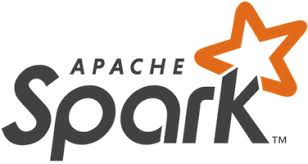

Have you ever wondered how Machine Learning Pipelines are built at scale? How can we deploy our ML models over a distributed cluster of machines so that our ML application scale horizontally? Do you want to convert your scikit-learn and pandas based ML workflow and take it to scale using Spark? Would it have been better if you had an working end-to-end application to refer? Then Read On the notebook [predict-us-census-income.ipynb](predict-us-census-income.ipynb) in this same folder.

`
@author: Anindya Saha
@email: mail.anindya@gmail.com
`

## Why we use Apache Spark for ML?

Almost all of us who starts with Machine Learning in Python starts developing and learning using scikit-learn, pandas in Python. The datasets that we use fit in our laptops and can run with 16GB of memory. However, in reality when we go to the industry the datasets are not tiny and we need to scale with GBs of data over several machines. In order to scale our algorithm on large datasets scikit-learn, pandas are not enough. Spark is inherently designed for distributed computation and they have a [MLlib](https://spark.apache.org/docs/latest/ml-guide.html) package which has scalable implementation of most common algorithms. 

Data Scientists usually work on a sample of the data to devise and tune their algorithms and when they are satisfied with the model's performance they then need to deploy that at scale in production. Sometimes they themselves do it or if you are working as an Applied ML Engineer or ML Software Engineer then the Data Scientist might seek your help in transforming his pandas, scikit-learn based codes into a more scalable and distributable deployment working over large datasets. While doing that soon you will realize not exactly everything of scikit-learn, pandas is implemented in Spark. Spark community is adding more ML implementations. But there are some constraints imposed by the distributed nature of the large data sets across machines that all features and functions that the Data Scientist have leveraged from Pandas is not available. Also, sometimes some functionalities such as StratifiedSampling will not be directly implemented in Spark. You have to use the existing Spark APIs to realize the same.

This post was inspired when a Graduate Data Science engineer seeked my help to convert his own scikit-learn and pandas code to PySpark. While doing that I added more functionalities and implementation that you would find useful and handy and will serve as a ready reference implementation. 

Although Spark is written in Python there is no inherent visualization capabilities. This work covers - EDA, custom udf, cleaning, basic missing values treatment, data variance per feature, stratified sampling (custom implementation), class weights for imbalanced class distribution (custom code), onehotencoding, standard scaling, vector assembling, label encoding, grid search with cross validation, pipeline, partial pipelines (custom code), binary and multi class evaluators and new metrics introduced in Spark 2.3.0, auc_roc, roc curves, model serialization and deserialization.

## What is Apache Spark?

Apache Spark is a fast cluster computing framework which is used for processing, querying and analyzing Big data. It is based on In-memory computation, which is a big advantage of Apache Spark over several other big data Frameworks. Apache Spark is open source and one of the most famous Big data framework. It can run tasks up to 100 times faster, when it utilizes the in-memory computations and 10 times faster when it uses disk than traditional map-reduce tasks. Read this article to learn more about Spark
https://www.analyticsvidhya.com/blog/2016/09/comprehensive-introduction-to-apache-spark-rdds-dataframes-using-pyspark/

It provides high-level APIs in Java, Scala, Python and R, and an optimized engine that supports general execution graphs. It also supports a rich set of higher-level tools including Spark SQL for SQL and structured data processing, MLlib for machine learning, GraphX for graph processing, and Spark Streaming.

Even more: https://spark.apache.org/docs/latest/

# Predicting US Census Income Category with Apache Spark

## Problem Statement

In this [notebook](predict-us-census-income.ipynb), we try to predict a person's income is above or below 50K$/yr given based on features such as workclass, no of years of education, occupation, relationship, marital status, hours worked per week, race, sex etc. But the catch is here we will do entirely in PySpark. We will use the most basic model of Loagistic Regression here. The goal of the notebook is not to get too fancy with the choice of the Algorithms but its more on how can you achieve or at least try to achieve what you could do using scikit-learn and pandas.

## BINARY CLASSIFICATION : LOGISTIC REGRESSION

US Adult Census data relating income to social factors such as Age, Education, race etc.

The Us Adult income dataset was extracted by Barry Becker from the 1994 US Census Database. The data set consists of anonymous information such as occupation, age, native country, race, capital gain, capital loss, education, work class and more. Each row is labelled as either having a salary greater than ">50K" or "<=50K".

This Data set is split into two CSV files, named `adult-training.txt` and `adult-test.txt`.

The goal here is to train a binary classifier on the training dataset to predict the column income_bracket which has two possible values ">50K" and "<=50K" and evaluate the accuracy of the classifier with the test dataset.

Note that the dataset is made up of categorical and continuous features. It also contains missing values. The categorical columns are: workclass, education, marital_status, occupation, relationship, race, gender, native_country

The continuous columns are: age, education_num, capital_gain, capital_loss, hours_per_week.

This Dataset was obtained from the UCI repository, it can be found at:

https://archive.ics.uci.edu/ml/datasets/census+income  
http://mlr.cs.umass.edu/ml/machine-learning-databases/adult/
